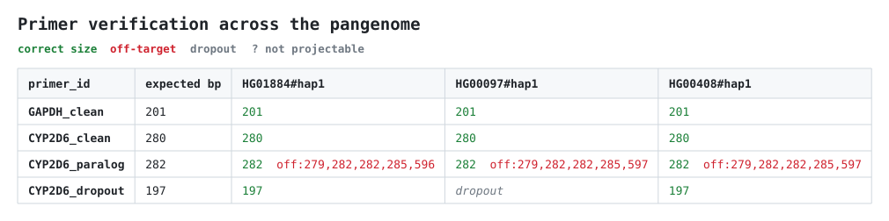

# 🧬 Pangenome PCR Primer Design

Design and screen PCR primers against the **HPRC R2 human pangenome** instead of a single reference. Primers are tested across many phased haplotypes, so two failures a single reference hides are caught before you order oligos:

- **Dropout** — a SNP/indel under a primer's 3′ end kills the product in carriers.
- **Off-target** — a paralog the reference collapses into one copy gives extra bands.

Two pipelines share one engine: **verify** (bring your own primers) and **design** (give it a target).



Above: four pairs across three haplotypes. **Green** = correct amplicon, **red** = off-target, grey = **dropout**. The CYP2D6 paralog pair co-amplifies the CYP2D7 pseudogene; the dropout pair fails in one of the three, because [rs1058164](https://www.ncbi.nlm.nih.gov/snp/rs1058164) sits under its forward primer's 3′ terminal base.

> [!NOTE]
> **Three haplotypes show that a failure exists, not how common it is.** That dropout lands on the European haplotype, which invites calling rs1058164 a European variant. It isn't. Across **30 haplotypes** the same pair fails in **11 of 24 evaluable (46%)**, in every superpopulation — AFR 2/5, AMR 3/6, EAS 1/3, EUR 3/5, SAS 2/5. Size the panel to the claim you want to make.

**New here?** Plain-language intros: [design](docs/intro_design_pipeline.md) · [verify](docs/intro_verify_pipeline.md). Also [`CONTEXT.md`](CONTEXT.md) (glossary), [config reference](docs/config_reference.md), and [sizing](docs/sizing.md) if you run on anything bigger than a laptop.

> [!WARNING]
> **First-time data setup is the slow part.** Downloading and preparing genomes is a one-time job — ~30 min for the 3-haplotype demo, hours for a large subset. Runs themselves take under a minute per pipeline.
>
> | | 3-haplotype demo |
> |---|---|
> | Storage | ~11 GB — 0.91 GB/haplotype (BGZF `.fa.gz` + `.fai`/`.gzi` + ~4 MB anchor grid), plus ~8.5 GB for CHM13 |
> | Memory | ~1 GB for search and projection; the one-time grid build peaks ~11 GB |
>
> No per-haplotype index is built at all — not the 3.08 GB uncompressed `.fa`, nor a 5.31 GB search index, nor the 5.80 GB minimap2 index the anchor grid replaces.

## ⚙️ How it works

Target (CHM13 region, GRCh38 region, or FASTA) → anchor on **CHM13 v2.0** → project onto each haplotype → mask variable sites → **Primer3** candidates → exhaustive genome-wide binding search → **thermodynamic**, 3′-aware dropout classification → pair into amplicons → per-haplotype status (`pass`/`dropout`/`off_target`/`multi_product`/`uncertain`) → rank by coverage + specificity → TSV/JSON + HTML.

## 🛠️ Setup

```bash
mamba env create -f env/environment.yml
mamba activate pangenome-primer
pip install -e .
```

Quick check, no data needed:

```bash
pangenome-primer selftest --outdir selftest_out   # synthetic pangenome, all 5 statuses
pytest -q
```

## 📥 Get the data

Pick a haplotype subset and pin provenance from the official HPRC index — manifest first, then the multi-GB pull. Default is the demo's 3 haplotypes: hap1 of HG01884 (AFR), HG00097 (EUR), HG00408 (EAS).

```bash
pangenome-primer fetch-subset                              # manifest only, 3 haplotypes
pangenome-primer fetch-subset --download                   # pull them (~3 GB) + verify md5
pangenome-primer fetch-subset --per-superpop 3 --download  # 5 superpops × 3 samples × 2 haps = 30
pangenome-primer fetch-subset --all --download             # all ~460 haplotypes
```

`--download` prints a disk/RAM resource check and asks before a large pull; `--yes` skips it in scripts.

CHM13 v2.0 reference:

```bash
curl -O https://human-pangenomics.s3.amazonaws.com/T2T/CHM13/assemblies/analysis_set/chm13v2.0.fa.gz
gunzip chm13v2.0.fa.gz && samtools faidx chm13v2.0.fa
```

Then prepare the haplotypes (download → md5 → BGZF `faidx` → anchor grid). Resumable, logs to `hprc-r2/prepare.log`:

```bash
bash scripts/prepare_haplotypes.sh
```

Budget **~4.5 min per haplotype** for the anchor grid (measured over 27 builds — see [sizing](docs/sizing.md)), and run it unattended for a large subset.

Assemblies stay compressed: the scanner streams the BGZF, and `pysam` random-accesses it through `.fai`/`.gzi`. Projection uses a **sparse anchor grid** — ~1 kb probes every 10 kb, mapped against the *shared* CHM13 index, so one large index serves every haplotype. The grid is ~4 MB and locates a target to within a few kb; the exact coordinate comes from a base-level realignment of that window, so accuracy is unchanged.

## ▶️ Run the design pipeline

```bash
pangenome-primer run --target chr1:1200-1400 --chm13 CHM13v2.0.fa \
    --samples config/samples.tsv --outdir results
```

`--target` accepts a CHM13 region (default), a GRCh38 region, or a FASTA of the locus:

```bash
# GRCh38 coordinates — the slice is fetched from the GRCh38 reference and aligned to CHM13
pangenome-primer run --target chr22:42126499-42130810 --target-assembly grch38 \
    --grch38 GRCh38.fa --chm13 CHM13v2.0.fa --samples config/samples.tsv --outdir results

# Just a locus sequence, no coordinates and no reference genome needed
pangenome-primer run --target my_locus.fa --chm13 CHM13v2.0.fa --samples config/samples.tsv
```

Nextflow, for per-haplotype parallelism:

```bash
nextflow run main.nf -profile local \
    --target chr1:1200-1400 --chm13 CHM13v2.0.fa --samples config/samples.tsv --outdir results
```

Tune thresholds in `config/defaults.yaml`.

## 🔍 Verify existing primers

Input CSV — `target` is the intended amplicon region (GRCh38 by default):

```csv
primer_id,target,forward,reverse
GAPDH_ex,chr12:6534000-6534240,CGCTTCATGCTGCACATCTC,TTCAGTAATGGCTGCCTGGG
```

```bash
pangenome-primer verify --primers primers.csv --chm13 CHM13v2.0.fa --grch38 GRCh38.fa \
    --samples config/samples.tsv --outdir verify_out   # --target-assembly chm13 for CHM13 coords
```

Writes `verify_matrix.html` plus `verify.json`/`.tsv`: **one column per primer pair, one row per haplotype** (haplotypes go on the vertical axis because that count grows — 3, 30, ~460 — while pairs stay few). Cells show product sizes; `?` means the locus could not be projected, and `>100 binding sites` means a repeat-derived primer binds too widely to score.

Each pair gets a **summary** row: on-target coverage plus per-failure-mode counts. Coverage is measured over *evaluable* haplotypes (total − not-projectable) and credits a haplotype whose target amplifies even alongside an extra band — the same `on_target_coverage` the design pipeline ranks on. `verify.tsv` carries the same numbers as sortable columns.

## 🚧 Not yet

- The full ~460-haplotype / cloud-scale run.

## 🙏 Acknowledgements

Built entirely on public genome resources: the [HPRC](https://humanpangenome.org/) Release 2 phased assemblies and the [T2T](https://github.com/marbl/CHM13) CHM13 v2.0 reference, both via the [`human-pangenomics`](https://github.com/human-pangenomics) AWS Open Data bucket. Thanks to those consortia and to the sample donors.

| Tool | Role here |
|---|---|
| [Primer3](https://github.com/primer3-org/primer3) / [primer3-py](https://github.com/libnano/primer3-py) | Candidate design and the nearest-neighbor thermodynamic model |
| [PyO3](https://pyo3.rs/) / [maturin](https://www.maturin.rs/), [rayon](https://github.com/rayon-rs/rayon), [flate2](https://github.com/rust-lang/flate2-rs) | The compiled BGZF scanner: bindings, parallelism, pure-Rust inflate |
| [minimap2](https://github.com/lh3/minimap2) / [mappy](https://pypi.org/project/mappy/) | Anchoring on CHM13 and locus projection |
| [SAMtools / HTSlib](https://www.htslib.org/) / [pysam](https://github.com/pysam-developers/pysam) | FASTA indexing and random access |
| [SeqKit](https://github.com/shenwei356/seqkit) | FASTA/Q manipulation |
| [Nextflow](https://www.nextflow.io/) | Orchestration and the scale-out path |
| [Quarto](https://quarto.org/) | Optional Markdown → HTML rendering |
| [Click](https://click.palletsprojects.com/), [Jinja2](https://jinja.palletsprojects.com/), [PyYAML](https://pyyaml.org/) | CLI, templating, configuration |

**Please cite:**

- HPRC — [Liao, W.-W., *et al.* (2023). *Nature* **617**, 312–324.](https://doi.org/10.1038/s41586-023-05896-x)
- CHM13 v2.0 — [Nurk, S., *et al.* (2022). *Science* **376**, 44–53.](https://doi.org/10.1126/science.abj6987)
- Primer3 — [Untergasser, A., *et al.* (2012). *Nucleic Acids Research* **40**, e115.](https://doi.org/10.1093/nar/gks596)
- minimap2 — [Li, H. (2018). *Bioinformatics* **34**, 3094–3100.](https://doi.org/10.1093/bioinformatics/bty191)
- SAMtools / HTSlib — [Danecek, P., *et al.* (2021). *GigaScience* **10**, giab008.](https://doi.org/10.1093/gigascience/giab008)
- SeqKit2 — [Shen, W., *et al.* (2024). *iMeta* **3**, e191.](https://doi.org/10.1002/imt2.191)
- Nextflow — [Di Tommaso, P., *et al.* (2017). *Nature Biotechnology* **35**, 316–319.](https://doi.org/10.1038/nbt.3820)
